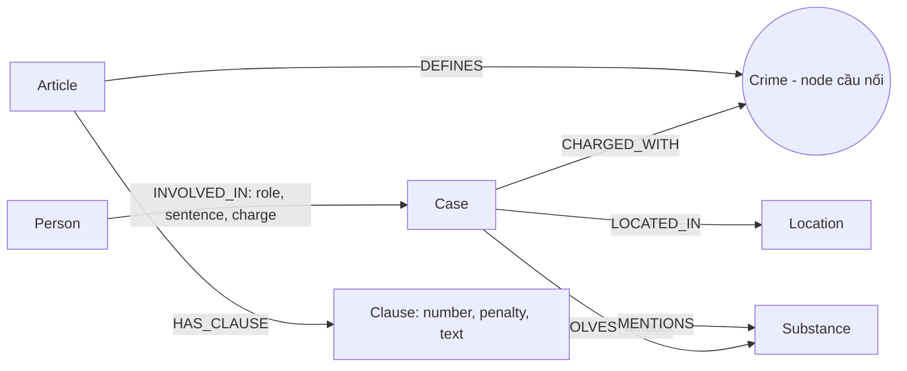

# Thiết kế Ontology — Day 19

**Họ tên:** Nguyen Minh Kiet  **MSSV:** 2A202602373

**Lựa chọn:**
- [x] Dùng ontology gợi ý
- [ ] Tự thiết kế

## 1. Sơ đồ

`Crime` là node cầu nối giữa tin tức và luật. `Substance` là thực thể dùng chung khác
giữa hai KB, nhưng đường trả lời tội danh và căn cứ điều luật chính đi qua `Crime`.

## 2. Entity types (node labels)

| Label | Ý nghĩa | Khóa định danh (`MERGE` theo) | Properties | Lấy từ KB nào | Trích bằng |
| --- | --- | --- | --- | --- | --- |
| `Article` | Một điều luật | `id` (ví dụ `Điều 251 BLHS`) | `title`, `law`, `doc_id` | Luật | Regex/front matter |
| `Clause` | Khoản trong điều luật | `id` (Article ID + số khoản) | `number`, `penalty`, `text`, `doc_id` | Luật | Regex |
| `Crime` | Tội danh chuẩn trong luật | `name` đã chuẩn hóa | `name` | Luật và tin tức | Regex tiêu đề luật; LLM + `link_entity` cho tin |
| `Case` | Vụ việc/vụ án được bài báo mô tả | `name` | `summary`, `date`, `doc_id`, `source_title` | Tin tức | LLM |
| `Substance` | Chất ma túy | `name` | `name` | Luật và tin tức | Regex trong luật; LLM trong tin |
| `Person` | Cá nhân được nhắc trong vụ | `name` | `name`, `aliases` | Tin tức | LLM |
| `Location` | Địa điểm liên quan vụ việc | `name` | `name` | Tin tức | LLM |

Các node trích trực tiếp từ một tài liệu (`Article`, `Clause`, `Case`) mang `doc_id`
đúng bằng `Document.id`. Các node dùng chung (`Crime`, `Substance`, `Person`,
`Location`) được gộp theo khóa chuẩn, nên có thể liên quan đến nhiều tài liệu.

## 3. Relationships

| Type | Từ → Đến | Properties trên cạnh | Ý nghĩa |
| --- | --- | --- | --- |
| `DEFINES` | `Article` → `Crime` | — | Điều luật quy định tội danh |
| `HAS_CLAUSE` | `Article` → `Clause` | — | Điều luật gồm khoản |
| `MENTIONS` | `Clause` → `Substance` | — | Khoản luật nêu chất ma túy |
| `CHARGED_WITH` | `Case` → `Crime` | — | Vụ án gắn với tội danh |
| `INVOLVES` | `Case` → `Substance` | `amount` | Vụ án liên quan chất/khối lượng |
| `LOCATED_IN` | `Case` → `Location` | — | Địa điểm vụ việc |
| `INVOLVED_IN` | `Person` → `Case` | `role`, `sentence`, `charge` | Vai trò, mức án và tội danh của người trong vụ |

## 4. Node cầu nối giữa 2 KB

- **Node:** `Crime`.
- **Lý do:** điều luật định nghĩa `Crime` bằng `DEFINES`; vụ án trong tin liên kết đến
  cùng tội danh bằng `CHARGED_WITH`. Tên tội xuất hiện ở cả hai KB.
- **Chuẩn hóa:** regex lấy tên tội từ tiêu đề luật; prompt trích tin đưa danh sách tên
  chuẩn vào LLM; `link_entity` chuẩn hóa hai phía, so khớp chính xác trước rồi mới
  fuzzy-match với cutoff 0.8. Không đủ giống thì không tạo liên kết tội danh.
- **Nguy cơ gãy và xử lý:** tội danh báo chí có thể viết tắt/sai chính tả hoặc LLM trả
  tên không tương ứng. Khi đó `link_entity` trả `None`, cạnh `CHARGED_WITH` không được
  tạo; kiểm tra danh sách tội trích xuất và thêm alias/chuẩn hóa có kiểm soát, không
  tự nối các tên không đủ tin cậy.

## 5. Competency questions

| Câu | Đường đi (Cypher pattern) | Trả lời được? |
| --- | --- | --- |
| Q1 | `(:Article {id:'Điều 2 Luật PCMT'})-[:HAS_CLAUSE]->(:Clause)`; lấy nội dung định nghĩa từ `Clause.text` (và đối chiếu chunk nguồn). | Có, nếu khoản định nghĩa được regex tách từ Điều 2. |
| Q2 | `(:Person)-[r:INVOLVED_IN {sentence: ...}]->(:Case)`; lọc các bị cáo trong vụ có tiêu đề/nội dung nhận diện là đường dây hơn 36 kg. | Có, phụ thuộc LLM trích đủ người và mức án. |
| Q3 | `(:Person {name:'Lê Minh Thành'})-[:INVOLVED_IN]->(k:Case)-[:CHARGED_WITH]->(c:Crime)<-[:DEFINES]-(a:Article)-[:HAS_CLAUSE]->(cl:Clause {number:1})`. Mức án lấy từ quan hệ `INVOLVED_IN.sentence`. | Có, nếu trích được người/tội danh và nối được `Crime`. |
| Q4 | `(:Person {aliases:['Hoàng Nato']})-[:INVOLVED_IN]->(k:Case)-[:CHARGED_WITH]->(c:Crime)<-[:DEFINES]-(a:Article)-[:HAS_CLAUSE]->(cl:Clause)`; lấy toàn bộ khoản khi câu hỏi yêu cầu mức tối đa/cao nhất. | Có, tùy LLM trích alias và tội danh chính xác. |
| Q5 | `(:Person {name:'Cái Quang Huy'})-[:INVOLVED_IN]->(k:Case)-[:INVOLVES {amount:...}]->(s:Substance {name:'MDMA'})`; tiếp tục `k-[:CHARGED_WITH]->c<-[:DEFINES]-a-[:HAS_CLAUSE]->cl-[:MENTIONS]->s`. Dùng `cl.text` xác định ngưỡng khối lượng và khoản. | Có, nếu LLM giữ đúng chất/khối lượng và Clause có nhắc chất đó. |
| Q6 | `(:Substance {name:'MDMA'})<-[:INVOLVES]-(k:Case)`; nối `(:Person)-[:INVOLVED_IN]->(k)` để liệt kê người/vụ. | Có, với các vụ được trích và chuẩn hóa MDMA thành cùng tên. |

## 6. Quyết định thiết kế và đánh đổi

1. **Tách Điều (`Article`) và khoản (`Clause`).** Phương án gọn hơn là lưu cả điều thành
   một node. Tách khoản cho phép trả lời khung cơ bản hoặc khoản theo ngưỡng chất cụ
   thể; đổi lại regex phải nhận diện cấu trúc khoản chính xác.
2. **Dùng `Crime` làm cầu nối, tên chuẩn từ luật.** Phương án khác là nối trực tiếp
   `Case` với `Article` bằng số điều LLM trích. Chọn `Crime` vì cả hai KB mô tả tội
   danh, và kiểm soát được tên luật làm chuẩn; đánh đổi là lỗi chuẩn hóa có thể làm
   đứt cầu.
3. **Dùng regex cho luật, LLM cho tin.** Luật có cấu trúc đều, nên regex giảm chi phí
   và cho kết quả lặp lại; văn xuôi tin tức cần LLM để trích người, vụ án, mức án và
   lượng chất. Đổi lại, extraction LLM có thể bỏ sót hoặc tự diễn giải.
4. **MERGE thực thể dùng chung theo tên chuẩn.** Cách này dễ truy vấn và gộp tội/chất
   giữa KB; tên người/vụ có thể trùng hoặc biến thể, nên ontology gợi ý vẫn có nguy cơ
   trùng thực thể.

## 7. So với ontology gợi ý

Không xét bonus; triển khai theo ontology gợi ý.

| Điểm khác | Gợi ý làm gì | Bạn làm gì | Vấn đề nó giải quyết | Bằng chứng |
| --- | --- | --- | --- | --- |
| — | — | Không thay đổi có chủ đích | Không tuyên bố cải thiện so với ontology gợi ý | Không áp dụng |

## 8. Hạn chế còn lại

- `Case` và `Person` dùng tên làm khóa; các tên/biệt danh khác nhau có thể tạo node trùng.
- Danh sách chất chuẩn hữu hạn; tên lóng/hoạt chất mới có thể không nối được giữa hai KB.
- Khoản luật được chọn theo khoản 1 và chất liên quan; câu hỏi cần khoản theo tình tiết
  định khung khác có thể cần đưa thêm dữ kiện/tình tiết vào truy vấn.
- Kết quả LLM phụ thuộc chất lượng trích xuất; cần đối chiếu graph với bài báo gốc và
  không coi câu trả lời là tư vấn pháp lý.
